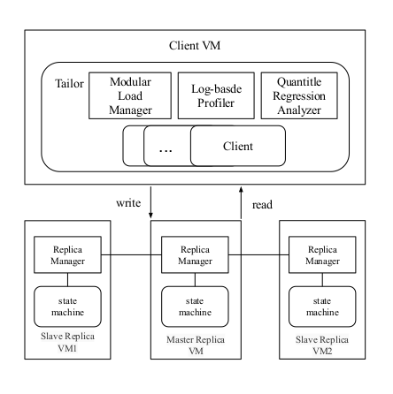

# Tailor
Tailor的实验代码，和在openstack创建集群及其配置脚本，具体实验配置按照自身环境更改后在配置。

#### 实验架构：

#### 软硬件参数：

#### 运行命令：

##### 运行 zk test

./output/run_me --addr 10.0.0.10:2181,10.0.0.33:2181,10.0.0.30:2181 --server_type zk

##### 运行 etcd test
./output/run_me --addr http://10.0.0.12:2379,http://10.0.0.23:2379,http://10.0.0.7:2379 --server_type etcd 

./output/run_me --addr http://localhost:2379

##### 运行 consul test
./output/run_me --addr http://10.0.0.10:8500,http://10.0.0.33:8500,http://10.0.0.30:8500 --server_type consul

